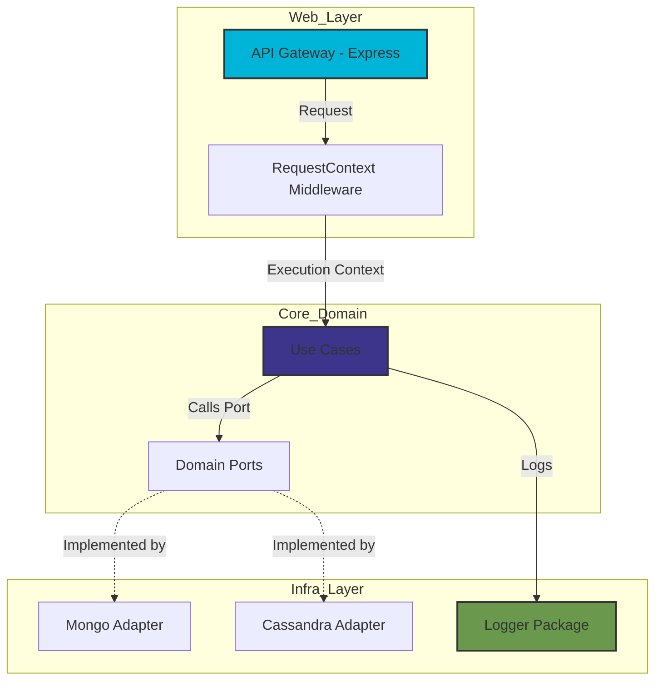

# Caddisfly Monorepo

Caddisfly is a production-grade, modular monorepo structured around **Hexagonal Architecture**. It serves as a showcase for clean, scalable, and observable Node.js infrastructure.

### Why this architecture?

Caddisfly is built on the **Hexagonal Architecture** (Ports and Adapters) pattern. By strictly separating the core business logic (Use Cases) from external concerns (Web Frameworks, Database Drivers), the system achieves:

* **Testability**: The core logic can be tested in isolation without needing a running database or HTTP server.
* **Flexibility**: Infrastructure components can be swapped (e.g., migrating from MongoDB to a different storage engine) with minimal changes to the domain logic.
* **Observability**: By utilizing `AsyncLocalStorage` and structured logging (Pino), every transaction is traceable from the initial HTTP request to the final database write, providing a clear audit trail for production monitoring.

---

### Architectural Component Diagram



---

### Component Breakdown

* **API Gateway (Express)**: The primary entry point. It handles incoming requests, validates input, and initiates the domain process.
* **Middleware**: Responsible for generating a unique `traceId` per request and injecting it into the `AsyncLocalStorage` context.
* **Use Cases (Core Domain)**: The "brain" of the application. It orchestrates the flow of data but has zero knowledge of how the database or web server operates.
* **Domain Ports (Interfaces)**: These define the "contracts" that the infrastructure must follow. The Use Case relies on these interfaces, not the concrete implementation.
* **Adapters (Infrastructure)**: The implementation of the Ports. Whether it is `db-mongo` or `db-cassandra`, these adapters fulfill the contract, allowing the system to talk to different databases seamlessly.
* **Shared Packages**: Foundational code like the `logger` is shared across the entire monorepo, ensuring standardized telemetry formatting.

This structure is highly professional and demonstrates that you understand the complexities of building scalable, maintainable distributed systems.

**Does this Mermaid diagram and description accurately capture the vision you have for your portfolio? If so, we can jump into writing the first actual Use Case logic.**

## 🏗 Architecture

This project implements the Ports and Adapters (Hexagonal) pattern to ensure domain logic remains independent of infrastructure (databases, web frameworks, external APIs).

* **`apps/`**: Entry points (API Gateways, CLI tools).
* **`packages/`**: Shared domain logic, logger, and database adapters.
* **Observability**: Fully integrated logging pipeline using **Pino**, **Grafana Loki**, and **Tempo** for distributed tracing.

## 🚀 Key Technical Features

* **Monorepo Orchestration**: Managed by [Turbo](https://turbo.build/repo) for lightning-fast incremental builds and caching.
* **Observability**: Custom `AsyncLocalStorage` middleware for request tracing. Logs are structured in JSON for native ingestion into the Grafana stack.
* **Strict Typing**: Shared TypeScript configurations enforced across all packages via `@repo/typescript-config`.
* **Resilience**: Graceful shutdown sequences ensuring data integrity during deployments.

## 🛠 Prerequisites

* [pnpm](https://pnpm.io/) (v9+)
* Node.js (LTS)

## 📦 Getting Started

1. **Clone the repository**
2. **Install dependencies**
```bash
pnpm install

```


3. **Run in development**
```bash
pnpm dev

```

## 🏗 Monorepo Commands

| Command | Description |
| --- | --- |
| `pnpm build` | Build all applications and packages |
| `pnpm lint` | Lint all packages using ESLint |
| `pnpm dev` | Run all applications in watch mode |

---
